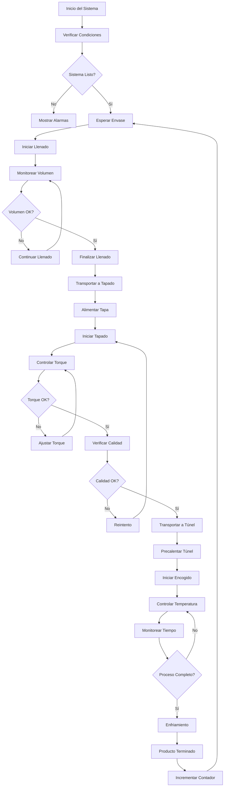

# 📋 DOCUMENTACIÓN TÉCNICA - PLANTA PROCESO PULPAS

## 🎯 DESCRIPCIÓN GENERAL

### Propósito del Sistema
El sistema de control automatizado para la planta de procesamiento de pulpas de frutas está diseñado para gestionar de manera eficiente y segura el proceso completo de producción, desde el llenado de envases hasta el túnel de encogido final.

### Arquitectura del Sistema
```
┌─────────────────┐    ┌─────────────────┐    ┌─────────────────┐
│   ESTACIÓN 1    │    │   ESTACIÓN 2    │    │   ESTACIÓN 3    │
│    LLENADO      │───▶│     TAPADO      │───▶│ TÚNEL ENCOGIDO  │
│                 │    │                 │    │                 │
│ FB_FillingProcess│    │FB_CappingProcess│    │FB_ShrinkTunnel  │
└─────────────────┘    └─────────────────┘    └─────────────────┘
         │                       │                       │
         └───────────────────────┼───────────────────────┘
                                 │
                    ┌─────────────────┐
                    │   MAIN_OB1      │
                    │ Control Central │
                    └─────────────────┘
```

---

## 🔧 COMPONENTES DEL SISTEMA

### 1. FB_FillingProcess - Proceso de Llenado

#### Funcionalidad Principal
- Control preciso del volumen de llenado
- Monitoreo continuo del nivel del envase
- Gestión de flujo de producto
- Detección de presencia de envase
- Control de calidad del llenado

#### Entradas (VAR_INPUT)
| Variable | Tipo | Descripción |
|----------|------|-------------|
| Start | Bool | Comando de inicio del proceso |
| Stop | Bool | Comando de parada del proceso |
| Reset | Bool | Reset de alarmas |
| ManualMode | Bool | Activación del modo manual |
| SetVolume | Real | Volumen objetivo en litros |
| ContainerPresent | Bool | Sensor de presencia de envase |
| LevelSensor | Real | Sensor de nivel (0-100%) |
| FlowSensor | Real | Sensor de flujo (L/min) |

#### Salidas (VAR_OUTPUT)
| Variable | Tipo | Descripción |
|----------|------|-------------|
| FillingValve | Bool | Control de válvula de llenado |
| ConveyorMotor | Bool | Motor de banda transportadora |
| ProcessActive | Bool | Indicador de proceso activo |
| ProcessComplete | Bool | Indicador de proceso completado |
| AlarmActive | Bool | Indicador de alarma activa |
| CurrentVolume | Real | Volumen actual medido |
| ProcessTime | Time | Tiempo transcurrido del proceso |

#### Estados del Proceso
1. **Estado 0 - Espera**: Sistema en reposo, esperando comando de inicio
2. **Estado 10 - Posicionamiento**: Posicionamiento correcto del envase
3. **Estado 20 - Llenado**: Proceso activo de llenado con monitoreo
4. **Estado 30 - Finalización**: Cierre de válvula y estabilización
5. **Estado 40 - Completado**: Transporte a siguiente estación
6. **Estado 99 - Error**: Gestión de alarmas y condiciones de fallo

#### Códigos de Alarma
- **1001**: Envase no presente durante llenado
- **1002**: Timeout de llenado (>30 segundos)

### 2. FB_CappingProcess - Proceso de Tapado

#### Funcionalidad Principal
- Alimentación automática de tapas
- Control de torque de apriete
- Verificación de posición del cabezal
- Control de calidad del tapado
- Sistema de reintentos automáticos

#### Entradas (VAR_INPUT)
| Variable | Tipo | Descripción |
|----------|------|-------------|
| Start | Bool | Comando de inicio del proceso |
| Stop | Bool | Comando de parada del proceso |
| Reset | Bool | Reset de alarmas |
| ManualMode | Bool | Activación del modo manual |
| ContainerPresent | Bool | Sensor de presencia de envase |
| CapPresent | Bool | Sensor de presencia de tapa |
| TorqueSensor | Real | Sensor de torque (Nm) |
| PositionSensor | Real | Sensor de posición (mm) |
| SetTorque | Real | Torque objetivo (Nm) |

#### Salidas (VAR_OUTPUT)
| Variable | Tipo | Descripción |
|----------|------|-------------|
| CapFeeder | Bool | Alimentador de tapas |
| CappingMotor | Bool | Motor de tapado |
| ConveyorMotor | Bool | Motor de banda transportadora |
| ProcessActive | Bool | Indicador de proceso activo |
| ProcessComplete | Bool | Indicador de proceso completado |
| AlarmActive | Bool | Indicador de alarma activa |
| CurrentTorque | Real | Torque actual medido |
| ProcessTime | Time | Tiempo transcurrido del proceso |
| QualityOK | Bool | Indicador de calidad aprobada |

#### Estados del Proceso
1. **Estado 0 - Espera**: Sistema en reposo
2. **Estado 10 - Posicionamiento**: Posicionamiento del envase
3. **Estado 20 - Alimentación**: Suministro de tapa
4. **Estado 30 - Tapado**: Proceso de apriete con control de torque
5. **Estado 40 - Finalización**: Retiro del cabezal de tapado
6. **Estado 50 - Control de Calidad**: Verificación del tapado
7. **Estado 60 - Completado**: Transporte a siguiente estación
8. **Estado 99 - Error**: Gestión de alarmas

#### Códigos de Alarma
- **2001**: Envase no presente durante tapado
- **2002**: Falta de tapas en alimentador
- **2003**: Sobre-torque detectado
- **2004**: Timeout de tapado (>10 segundos)
- **2005**: Falla de control de calidad

### 3. FB_ShrinkTunnelProcess - Proceso de Túnel de Encogido

#### Funcionalidad Principal
- Control de temperatura por zonas
- Precalentamiento automático del túnel
- Control de tiempo de proceso
- Monitoreo de calidad del encogido
- Sistema de enfriamiento controlado

#### Entradas (VAR_INPUT)
| Variable | Tipo | Descripción |
|----------|------|-------------|
| Start | Bool | Comando de inicio del proceso |
| Stop | Bool | Comando de parada del proceso |
| Reset | Bool | Reset de alarmas |
| ManualMode | Bool | Activación del modo manual |
| ContainerPresent | Bool | Sensor de presencia de envase |
| TempSensor1 | Real | Sensor temperatura zona 1 (°C) |
| TempSensor2 | Real | Sensor temperatura zona 2 (°C) |
| TempSensor3 | Real | Sensor temperatura zona 3 (°C) |
| SetTemperature | Real | Temperatura objetivo (°C) |
| SetProcessTime | Time | Tiempo de proceso objetivo |
| ConveyorSpeed | Real | Velocidad de banda (m/min) |

#### Salidas (VAR_OUTPUT)
| Variable | Tipo | Descripción |
|----------|------|-------------|
| Heater1 | Bool | Calentador zona 1 |
| Heater2 | Bool | Calentador zona 2 |
| Heater3 | Bool | Calentador zona 3 |
| ConveyorMotor | Bool | Motor de banda transportadora |
| TunnelFan | Bool | Ventilador del túnel |
| ProcessActive | Bool | Indicador de proceso activo |
| ProcessComplete | Bool | Indicador de proceso completado |
| AlarmActive | Bool | Indicador de alarma activa |
| AvgTemperature | Real | Temperatura promedio |
| ProcessTime | Time | Tiempo transcurrido del proceso |
| QualityOK | Bool | Indicador de calidad aprobada |

#### Estados del Proceso
1. **Estado 0 - Espera**: Sistema en reposo
2. **Estado 10 - Precalentamiento**: Calentamiento inicial del túnel
3. **Estado 20 - Espera de Envase**: Mantenimiento de temperatura
4. **Estado 30 - Proceso**: Encogido activo con control de temperatura
5. **Estado 40 - Enfriamiento**: Enfriamiento controlado
6. **Estado 50 - Control de Calidad**: Verificación del proceso
7. **Estado 60 - Completado**: Finalización del proceso
8. **Estado 99 - Error**: Gestión de alarmas

#### Códigos de Alarma
- **3001**: Sobre-temperatura detectada
- **3002**: Falla de sensor de temperatura
- **3003**: Timeout de precalentamiento (>10 minutos)
- **3004**: Pérdida de temperatura durante proceso
- **3005**: Falla de calidad en encogido

---

## 📊 ESTRUCTURA DE DATOS (UDT_ProcessData)

### Organización de la Estructura
La estructura `UDT_ProcessData` centraliza toda la información del proceso en las siguientes secciones:

#### 1. Datos de Proceso
- **Filling**: Información del proceso de llenado
- **Capping**: Información del proceso de tapado
- **ShrinkTunnel**: Información del túnel de encogido

#### 2. Datos del Sistema
- **System**: Estado general, contadores, eficiencia
- **Sensors**: Estados de todos los sensores
- **Actuators**: Estados de todos los actuadores

#### 3. Configuración
- **Recipe**: Parámetros de receta configurable

### Ventajas de la Estructura Centralizada
- **Consistencia**: Todos los datos en una ubicación
- **Facilidad de acceso**: Navegación intuitiva
- **Escalabilidad**: Fácil expansión para nuevos procesos
- **Mantenimiento**: Simplifica el diagnóstico y mantenimiento

---

## 🔄 FLUJO DE PROCESO

### Secuencia Normal de Operación



### Condiciones de Seguridad
- **Parada de emergencia**: Detiene todos los procesos inmediatamente
- **Falta de envase**: Previene operación sin producto
- **Sobre-temperatura**: Protege equipos y producto
- **Sobre-torque**: Evita daños en tapas y envases

---

## ⚙️ CONFIGURACIÓN Y PARÁMETROS

### Parámetros de Receta Típicos

#### Producto Tipo 1 - Pulpa de Mango
```
Volumen: 500 ml
Torque de tapado: 2.5 Nm
Temperatura túnel: 180°C
Tiempo de proceso: 45 segundos
Velocidad banda: 2.0 m/min
```

#### Producto Tipo 2 - Pulpa de Guayaba
```
Volumen: 250 ml
Torque de tapado: 2.0 Nm
Temperatura túnel: 175°C
Tiempo de proceso: 40 segundos
Velocidad banda: 2.5 m/min
```

### Tolerancias de Calidad
- **Volumen**: ±2% del setpoint
- **Torque**: ±10% del setpoint
- **Temperatura**: ±5°C del setpoint
- **Tiempo**: ±5% del setpoint

---

## 🔍 DIAGNÓSTICO Y MANTENIMIENTO

### Indicadores de Rendimiento (KPIs)
- **Eficiencia del proceso**: (Productos OK / Total productos) × 100
- **Tiempo de ciclo promedio**: Tiempo total / Número de ciclos
- **Disponibilidad**: (Tiempo operativo / Tiempo total) × 100
- **Tasa de alarmas**: Número de alarmas / Hora de operación

### Mantenimiento Preventivo
#### Diario
- Verificar niveles de producto
- Inspeccionar sensores de presencia
- Limpiar superficies de contacto

#### Semanal
- Calibrar sensores de flujo y nivel
- Verificar torque de tapado
- Limpiar filtros de aire

#### Mensual
- Calibrar sensores de temperatura
- Verificar alineación de bandas transportadoras
- Inspeccionar conexiones eléctricas

#### Trimestral
- Calibración completa de instrumentos
- Verificar programas de control
- Actualizar parámetros de receta

---

## 🚨 GESTIÓN DE ALARMAS

### Clasificación de Alarmas
- **Críticas**: Requieren parada inmediata del proceso
- **Importantes**: Afectan la calidad del producto
- **Informativas**: Notificaciones de estado

### Procedimientos de Respuesta
1. **Identificar la alarma**: Código y descripción
2. **Evaluar la situación**: Seguridad y calidad
3. **Tomar acción correctiva**: Según procedimiento
4. **Documentar el evento**: Para análisis posterior
5. **Verificar solución**: Confirmar normalización

---

## 📈 OPTIMIZACIÓN DEL PROCESO

### Estrategias de Mejora
- **Análisis de datos históricos**: Identificar patrones
- **Ajuste de parámetros**: Optimizar setpoints
- **Mantenimiento predictivo**: Prevenir fallos
- **Capacitación del personal**: Mejorar operación

### Métricas de Seguimiento
- Tiempo de ciclo por producto
- Consumo energético por unidad
- Tasa de rechazo por estación
- Tiempo medio entre fallos (MTBF)

---

## 🔒 SEGURIDAD Y CUMPLIMIENTO

### Normas Aplicables
- **IEC 61131**: Controladores programables
- **IEC 61508**: Seguridad funcional
- **FDA 21 CFR Part 11**: Sistemas electrónicos (si aplica)
- **HACCP**: Análisis de peligros y puntos críticos

### Medidas de Seguridad Implementadas
- Parada de emergencia accesible
- Protecciones físicas en equipos móviles
- Monitoreo continuo de parámetros críticos
- Registro de eventos para trazabilidad

---

## 📞 SOPORTE TÉCNICO

### Información de Contacto
- **Desarrollador**: Equipo de Automatización
- **Versión del sistema**: 1.0.0
- **Fecha de creación**: 2024
- **Última actualización**: [Fecha actual]

### Recursos Adicionales
- Manual de operación
- Diagramas P&ID
- Esquemas eléctricos
- Procedimientos de mantenimiento

---

**📋 Fin de la documentación técnica**

*Este documento debe actualizarse con cada modificación del sistema*
